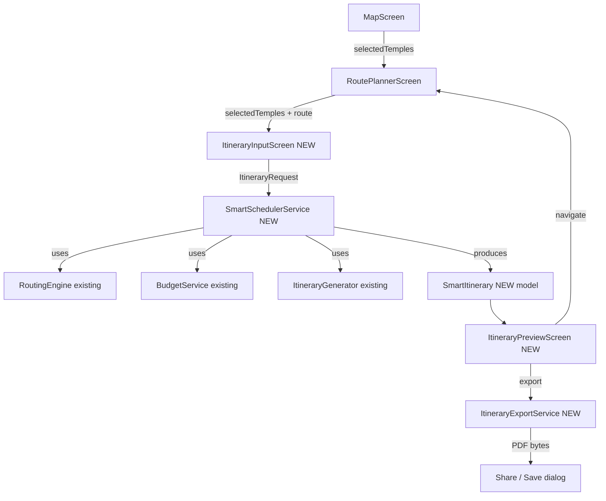
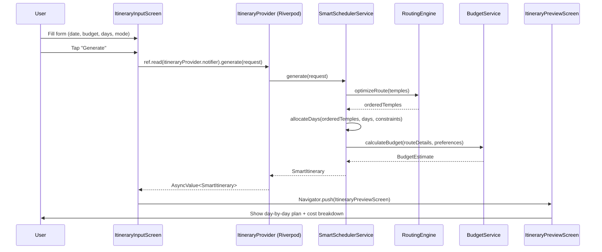
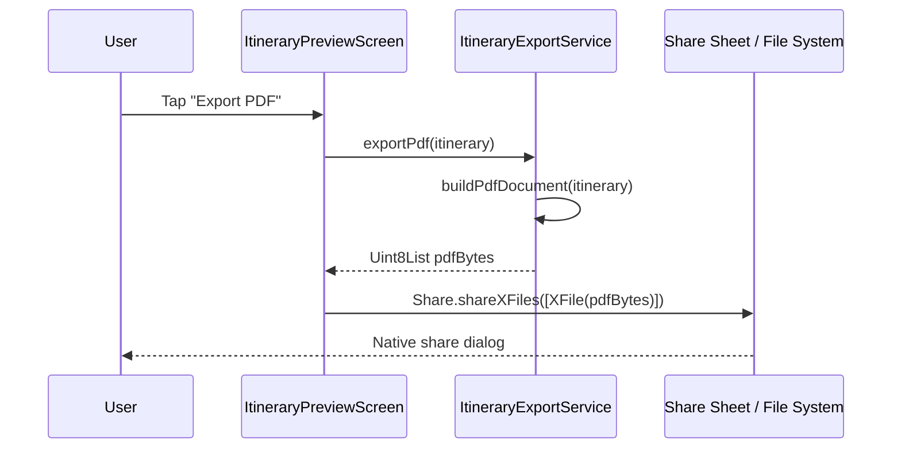

# Design Document: Smart Itinerary Generator

## Overview

The Smart Itinerary Generator is Feature 1 of the Temple Yatra product spec. It accepts a travel
date, budget, number of days, selected temples, travel mode, and optional stops, then produces a
day-by-day itinerary with optimized routing, cost estimates, and a downloadable PDF document.

The feature builds directly on the stabilized routing foundation (`RoutingEngine.optimizeRoute`,
`DirectionsService`, `BudgetService`, `ItineraryGenerator`) and introduces three new layers:
an input-collection UI (`ItineraryInputScreen`), a smart scheduling engine
(`SmartSchedulerService`), and a document export pipeline (`ItineraryExportService`). No
existing working screens are modified; the new screens are reached from `RoutePlannerScreen`
via a new "Generate Itinerary" action.

---

## Architecture



### Layer Responsibilities

| Layer | Files | Role |
|---|---|---|
| Input UI | `lib/screens/itinerary_input_screen.dart` | Collect travel params from user |
| Preview UI | `lib/screens/itinerary_preview_screen.dart` | Display day-by-day plan, cost summary |
| Scheduler | `lib/services/smart_scheduler_service.dart` | Core algorithm: day allocation, cost estimation |
| Export | `lib/services/itinerary_export_service.dart` | PDF generation and share sheet |
| Model | `lib/models/smart_itinerary.dart` | Immutable data types for the generated plan |
| Provider | `lib/providers/itinerary_provider.dart` | Riverpod state for async generation |

---

## Sequence Diagrams

### Main Flow: Generate Itinerary



### Export Flow



---

## Components and Interfaces

### ItineraryInputScreen

**Purpose**: Collects all user inputs needed to generate an itinerary.

**Interface**:
```dart
class ItineraryInputScreen extends ConsumerStatefulWidget {
  final List<Temple> selectedTemples;
  final GeneratedItinerary? existingItinerary; // optional pre-fill
  const ItineraryInputScreen({required this.selectedTemples, this.existingItinerary});
}
```

**Responsibilities**:
- Date picker for travel start date
- Number-of-days stepper (1–14)
- Budget input field (₹)
- Travel mode selector (Car / Bike / Bus)
- Optional stops text field
- "Generate" button that dispatches to `ItineraryProvider`

---

### ItineraryPreviewScreen

**Purpose**: Displays the generated itinerary and provides export action.

**Interface**:
```dart
class ItineraryPreviewScreen extends ConsumerWidget {
  final SmartItinerary itinerary;
  const ItineraryPreviewScreen({required this.itinerary});
}
```

**Responsibilities**:
- Day-by-day tab view or scrollable list
- Per-temple arrival/departure times, visit duration, travel distance
- Cost breakdown card (transport, stay, food, temple-specific)
- "Export PDF" FAB
- "Back to Route Planner" navigation

---

### SmartSchedulerService

**Purpose**: Core scheduling algorithm. Allocates temples to days, computes timings, estimates costs.

**Interface**:
```dart
class SmartSchedulerService {
  SmartItinerary generate(ItineraryRequest request);
}
```

**Responsibilities**:
- Delegate route ordering to `RoutingEngine.optimizeRoute`
- Allocate temples to days respecting `maxHoursPerDay` and `maxTemplesPerDay`
- Compute per-temple arrival/departure times starting from `startTime`
- Estimate transport, stay, food, and temple-specific costs via `BudgetService`
- Produce warnings when budget is exceeded or day is overloaded

---

### ItineraryExportService

**Purpose**: Converts a `SmartItinerary` to a PDF document and triggers the share sheet.

**Interface**:
```dart
class ItineraryExportService {
  Future<Uint8List> buildPdf(SmartItinerary itinerary);
  Future<void> shareAsPdf(SmartItinerary itinerary);
  Future<String> saveToFile(SmartItinerary itinerary);
}
```

**Responsibilities**:
- Use `pdf` package to build a structured document
- Include header (app name, trip title, date range), day sections, cost summary
- Trigger `share_plus` share sheet with the PDF bytes
- Optionally save to device Downloads folder

---

### ItineraryProvider (Riverpod)

**Purpose**: Manages async state for itinerary generation.

**Interface**:
```dart
final itineraryProvider =
    AsyncNotifierProvider<ItineraryNotifier, SmartItinerary?>(ItineraryNotifier.new);

class ItineraryNotifier extends AsyncNotifier<SmartItinerary?> {
  Future<void> generate(ItineraryRequest request);
  void reset();
}
```

**Responsibilities**:
- Expose `AsyncValue<SmartItinerary?>` to UI
- Call `SmartSchedulerService.generate` in an isolate-safe manner
- Surface errors as `AsyncError` for display in UI

---

## Data Models

### ItineraryRequest

```dart
class ItineraryRequest {
  final List<Temple> temples;       // user-selected temples (already ordered by MapScreen)
  final DateTime startDate;
  final int numberOfDays;           // 1–14
  final double maxBudget;           // ₹
  final VehicleType travelMode;
  final List<String> optionalStops; // free-text notes
  final TimeOfDay startTime;        // default 08:00
  final int maxTemplesPerDay;       // default 3
}
```

**Validation Rules**:
- `temples` must be non-empty
- `numberOfDays` in [1, 14]
- `maxBudget` >= 0 (0 = no limit)
- `startDate` must not be in the past

---

### SmartItinerary

```dart
class SmartItinerary {
  final ItineraryRequest request;
  final List<SmartDayPlan> days;
  final CostSummary totalCost;
  final double totalDistanceKm;
  final Duration totalDuration;
  final List<String> warnings;
  final DateTime generatedAt;
}
```

---

### SmartDayPlan

```dart
class SmartDayPlan {
  final int dayNumber;
  final DateTime date;
  final List<SmartTempleVisit> visits;
  final double dayDistanceKm;
  final Duration dayDuration;
  final DayCost dayCost;
}
```

---

### SmartTempleVisit

```dart
class SmartTempleVisit {
  final Temple temple;
  final int order;
  final DateTime arrivalTime;
  final DateTime departureTime;
  final Duration visitDuration;     // from temple.estimatedVisitDurationMinutes
  final double travelDistanceKm;
  final Duration travelDuration;
  final double travelCost;          // fuel/bus share for this leg
}
```

---

### CostSummary / DayCost

```dart
class CostSummary {
  final double transport;   // fuel or bus fare
  final double stay;        // accommodation (nights × rate)
  final double food;        // days × foodBudgetPerDay
  final double templeSpecific; // prasadam, offerings estimate
  final double misc;
  final double total;
  bool get isWithinBudget;
}

class DayCost {
  final double transport;
  final double food;
  final double templeSpecific;
  final double total;
}
```

---

## Algorithmic Pseudocode

### Main Scheduling Algorithm

```pascal
ALGORITHM SmartSchedulerService.generate(request)
INPUT: request of type ItineraryRequest
OUTPUT: itinerary of type SmartItinerary

PRECONDITIONS:
  request.temples.isNotEmpty
  request.numberOfDays IN [1, 14]
  request.maxBudget >= 0

BEGIN
  // Step 1: Optimize route order
  engine ← RoutingEngine(temples: request.temples)
  orderedTemples ← engine.optimizeRoute()

  ASSERT orderedTemples.length = request.temples.length
  ASSERT orderedTemples.first.id = 'birla_mandir_hyderabad'
         OR orderedTemples.first is westernmost temple

  // Step 2: Allocate temples to days
  days ← allocateDays(orderedTemples, request)

  ASSERT days.length <= request.numberOfDays
  ASSERT UNION(days[i].temples FOR ALL i) = orderedTemples

  // Step 3: Compute timings for each day
  FOR each day IN days DO
    computeTimings(day, request.startTime)
  END FOR

  // Step 4: Estimate costs
  costSummary ← estimateCosts(days, request)

  // Step 5: Collect warnings
  warnings ← []
  IF costSummary.total > request.maxBudget AND request.maxBudget > 0 THEN
    warnings.add('Estimated cost exceeds budget by ₹' + (costSummary.total - request.maxBudget))
  END IF

  RETURN SmartItinerary(
    request: request,
    days: days,
    totalCost: costSummary,
    warnings: warnings,
    generatedAt: DateTime.now()
  )
END

POSTCONDITIONS:
  result.days is non-empty
  result.totalCost.total >= 0
  result.warnings contains budget warning IF total > maxBudget AND maxBudget > 0
```

---

### Day Allocation Algorithm

```pascal
ALGORITHM allocateDays(temples, request)
INPUT: temples — ordered List<Temple>
       request — ItineraryRequest
OUTPUT: days — List<SmartDayPlan>

PRECONDITIONS:
  temples.isNotEmpty
  request.numberOfDays >= 1

BEGIN
  days ← []
  currentDay ← []
  currentDayMinutes ← 0
  dayIndex ← 0
  maxMinutesPerDay ← 10 * 60  // 10 hours
  maxTemplesPerDay ← request.maxTemplesPerDay  // default 3

  FOR each temple IN temples DO
    visitMinutes ← temple.estimatedVisitDurationMinutes ?? 45
    travelMinutes ← estimateTravelMinutes(lastTemple, temple, request.travelMode)
    totalMinutes ← visitMinutes + travelMinutes

    // Check if adding this temple would overflow the day
    IF currentDay.isNotEmpty AND
       (currentDay.length >= maxTemplesPerDay OR
        currentDayMinutes + totalMinutes > maxMinutesPerDay) THEN

      // Flush current day
      days.add(buildDayPlan(dayIndex, currentDay, request))
      dayIndex++
      currentDay ← []
      currentDayMinutes ← 0

      // Stop if we've used all available days
      IF dayIndex >= request.numberOfDays THEN
        BREAK
      END IF
    END IF

    currentDay.add(temple)
    currentDayMinutes += totalMinutes
  END FOR

  // Flush remaining temples into last day
  IF currentDay.isNotEmpty AND dayIndex < request.numberOfDays THEN
    days.add(buildDayPlan(dayIndex, currentDay, request))
  END IF

  RETURN days
END

LOOP INVARIANT:
  At the start of each iteration:
  - All temples in currentDay have been assigned to the current day
  - currentDayMinutes accurately reflects the sum of visit + travel minutes for currentDay
  - days contains all fully-allocated day plans so far

POSTCONDITIONS:
  days.length IN [1, request.numberOfDays]
  UNION(days[i].temples) is a prefix of temples (may be truncated if days run out)
  FOR ALL day IN days: day.visits.length <= maxTemplesPerDay
```

---

### Timing Computation

```pascal
ALGORITHM computeTimings(dayPlan, startTime)
INPUT: dayPlan — SmartDayPlan with visits list
       startTime — TimeOfDay (e.g. 08:00)
OUTPUT: dayPlan with arrivalTime and departureTime set on each visit

BEGIN
  currentTime ← dayPlan.date + startTime

  FOR i FROM 0 TO dayPlan.visits.length - 1 DO
    visit ← dayPlan.visits[i]

    IF i = 0 THEN
      travelDuration ← Duration.zero
    ELSE
      prevTemple ← dayPlan.visits[i - 1].temple
      travelDuration ← estimateTravelDuration(prevTemple, visit.temple, travelMode)
    END IF

    currentTime ← currentTime + travelDuration
    visit.arrivalTime ← currentTime

    visitDuration ← Duration(minutes: visit.temple.estimatedVisitDurationMinutes ?? 45)
    visit.departureTime ← currentTime + visitDuration
    currentTime ← visit.departureTime
  END FOR
END

LOOP INVARIANT:
  At the start of iteration i:
  - All visits[0..i-1] have valid arrivalTime and departureTime
  - currentTime = visits[i-1].departureTime (or startTime for i=0)
  - arrivalTime[j] < departureTime[j] for all j < i
  - departureTime[j] <= arrivalTime[j+1] for all j < i-1

POSTCONDITIONS:
  FOR ALL visit IN dayPlan.visits:
    visit.arrivalTime < visit.departureTime
  FOR ALL consecutive (v1, v2) IN dayPlan.visits:
    v1.departureTime <= v2.arrivalTime
```

---

### Cost Estimation

```pascal
ALGORITHM estimateCosts(days, request)
INPUT: days — List<SmartDayPlan>
       request — ItineraryRequest
OUTPUT: costSummary of type CostSummary

BEGIN
  totalTransport ← 0
  totalFood ← 0
  totalTempleSpecific ← 0
  totalStay ← 0
  totalMisc ← 0

  FOR each day IN days DO
    FOR each visit IN day.visits DO
      // Transport cost for this leg
      legCost ← estimateLegTransportCost(
        visit.travelDistanceKm,
        request.travelMode
      )
      totalTransport += legCost
      visit.travelCost ← legCost

      // Temple-specific cost (prasadam, entry, offerings estimate)
      templeCost ← estimateTempleCost(visit.temple)
      totalTempleSpecific += templeCost
    END FOR

    // Food per day
    totalFood += request.foodBudgetPerDay  // default ₹500/day
  END FOR

  // Accommodation: (numberOfDays - 1) nights
  nights ← MAX(0, request.numberOfDays - 1)
  totalStay ← nights * accommodationRatePerNight(request.accommodationType)

  totalMisc ← request.numberOfDays * 200  // ₹200/day misc

  RETURN CostSummary(
    transport: totalTransport,
    stay: totalStay,
    food: totalFood,
    templeSpecific: totalTempleSpecific,
    misc: totalMisc,
    total: totalTransport + totalStay + totalFood + totalTempleSpecific + totalMisc
  )
END

POSTCONDITIONS:
  costSummary.total = sum of all components
  costSummary.total >= 0
  costSummary.transport >= 0
```

---

## Key Functions with Formal Specifications

### SmartSchedulerService.generate

```dart
SmartItinerary generate(ItineraryRequest request)
```

**Preconditions:**
- `request.temples.isNotEmpty`
- `request.numberOfDays` in [1, 14]
- `request.maxBudget >= 0`
- `request.startDate` is not null

**Postconditions:**
- Returns a `SmartItinerary` with `days.isNotEmpty`
- `days.length <= request.numberOfDays`
- All temples in `request.temples` appear in `days` (unless truncated by day limit)
- `totalCost.total >= 0`
- If `totalCost.total > request.maxBudget && request.maxBudget > 0`, then `warnings` is non-empty

---

### allocateDays (internal)

```dart
List<SmartDayPlan> _allocateDays(List<Temple> orderedTemples, ItineraryRequest request)
```

**Preconditions:**
- `orderedTemples.isNotEmpty`
- `request.numberOfDays >= 1`
- `request.maxTemplesPerDay >= 1`

**Postconditions:**
- Result length in [1, `request.numberOfDays`]
- For all `day` in result: `day.visits.length <= request.maxTemplesPerDay`
- No temple appears in more than one day

**Loop Invariant:**
- `currentDayMinutes` equals the sum of visit + travel minutes for all temples in `currentDay`

---

### computeTimings (internal)

```dart
void _computeTimings(SmartDayPlan day, TimeOfDay startTime)
```

**Preconditions:**
- `day.visits.isNotEmpty`
- `startTime` is a valid time of day

**Postconditions:**
- For all `visit` in `day.visits`: `visit.arrivalTime.isBefore(visit.departureTime)`
- For all consecutive `(v1, v2)`: `!v1.departureTime.isAfter(v2.arrivalTime)`

**Loop Invariant:**
- `currentTime` equals `visits[i-1].departureTime` at the start of iteration `i`

---

### ItineraryExportService.buildPdf

```dart
Future<Uint8List> buildPdf(SmartItinerary itinerary)
```

**Preconditions:**
- `itinerary.days.isNotEmpty`

**Postconditions:**
- Returns non-empty `Uint8List` representing a valid PDF
- PDF contains one section per day in `itinerary.days`
- PDF contains a cost summary section

---

## Example Usage

```dart
// 1. User selects temples on MapScreen, navigates to RoutePlannerScreen,
//    then taps "Generate Itinerary"

// 2. ItineraryInputScreen collects params
final request = ItineraryRequest(
  temples: selectedTemples,
  startDate: DateTime(2025, 3, 15),
  numberOfDays: 2,
  maxBudget: 3000,
  travelMode: VehicleType.car,
  optionalStops: ['Lunch at Ohri\'s'],
  startTime: const TimeOfDay(hour: 8, minute: 0),
  maxTemplesPerDay: 3,
);

// 3. Provider generates itinerary
await ref.read(itineraryProvider.notifier).generate(request);

// 4. UI reads result
final itinerary = ref.watch(itineraryProvider);
itinerary.when(
  data: (plan) => ItineraryPreviewScreen(itinerary: plan!),
  loading: () => const CircularProgressIndicator(),
  error: (e, _) => Text('Error: $e'),
);

// 5. Export
final exportService = ItineraryExportService();
await exportService.shareAsPdf(plan);
```

---

## Correctness Properties

### Property 1: Route Ordering Preserved

For any `ItineraryRequest` with `temples.length >= 2`, the generated itinerary's temple
sequence across all days SHALL follow the same west-to-east order produced by
`RoutingEngine.optimizeRoute`. No temple SHALL appear in more than one day.

**Validates**: Day allocation preserves routing engine output.

---

### Property 2: Day Count Bounded

For any `ItineraryRequest` with `numberOfDays = N`, the generated itinerary SHALL have
`days.length <= N`. If `temples.length <= N * maxTemplesPerDay`, all temples SHALL appear
in the itinerary.

**Validates**: Day allocation respects the user's day constraint.

---

### Property 3: Timings Monotonically Increasing

For any generated `SmartDayPlan`, all visit arrival and departure times SHALL be
monotonically increasing: `arrivalTime[i] < departureTime[i]` and
`departureTime[i] <= arrivalTime[i+1]` for all consecutive visits.

**Validates**: `computeTimings` loop invariant holds throughout.

---

### Property 4: Cost Non-Negative and Additive

For any generated `SmartItinerary`, `totalCost.total` SHALL equal the sum of
`transport + stay + food + templeSpecific + misc`, and each component SHALL be >= 0.

**Validates**: Cost estimation arithmetic is correct.

---

### Property 5: Budget Warning Emitted

For any `ItineraryRequest` where `maxBudget > 0` and the estimated total cost exceeds
`maxBudget`, the generated itinerary SHALL contain at least one warning string.

**Validates**: Budget overflow detection is reliable.

---

### Property 6: PDF Non-Empty

For any `SmartItinerary` with at least one day, `ItineraryExportService.buildPdf` SHALL
return a `Uint8List` with `length > 0` and SHALL NOT throw.

**Validates**: Export pipeline handles all valid itinerary shapes.

---

### Property 7: Temples Per Day Bounded

For any generated `SmartDayPlan`, `visits.length <= request.maxTemplesPerDay`.

**Validates**: Day allocation loop invariant holds.

---

## Edge Cases

### EC-1: Single Temple Selected

When `request.temples.length == 1`, the itinerary SHALL have exactly one day with one visit.
No routing optimization is needed. Cost is computed for zero travel distance.

### EC-2: More Days Than Temples

When `request.numberOfDays > request.temples.length`, the itinerary SHALL have
`days.length == request.temples.length` (one temple per day). Remaining days are not created.

### EC-3: Budget = 0 (No Limit)

When `request.maxBudget == 0`, no budget warning SHALL be emitted regardless of cost.

### EC-4: Temple With No Visit Duration

When `temple.estimatedVisitDurationMinutes == null`, the scheduler SHALL default to 45 minutes.

### EC-5: All Temples Fit in One Day

When total visit + travel time for all temples is <= `maxHoursPerDay * 60`, all temples SHALL
be placed in day 1.

### EC-6: Temples Exceed Day Capacity

When temples cannot all fit within `numberOfDays * maxTemplesPerDay`, the scheduler SHALL
include as many as possible and add a warning listing omitted temples.

### EC-7: Export With Zero Cost

When all cost components are 0 (e.g. free temples, no accommodation), the PDF SHALL still
render a cost section showing ₹0 totals without crashing.

---

## Error Handling

### EH-1: RoutingEngine Returns Empty List

**Condition**: `RoutingEngine.optimizeRoute()` returns `[]` (e.g. empty temple list passed).
**Response**: `SmartSchedulerService.generate` throws `ArgumentError('temples must not be empty')`.
**Recovery**: `ItineraryProvider` surfaces as `AsyncError`; UI shows error SnackBar.

### EH-2: PDF Generation Failure

**Condition**: `pdf` package throws during document build (e.g. corrupt font, OOM).
**Response**: `ItineraryExportService.buildPdf` catches and rethrows as `ExportException`.
**Recovery**: `ItineraryPreviewScreen` shows a SnackBar: "Export failed. Please try again."

### EH-3: Share Sheet Unavailable

**Condition**: `share_plus` cannot open share sheet (e.g. no apps installed on device).
**Response**: `shareAsPdf` catches `ShareException` and falls back to `saveToFile`.
**Recovery**: Shows SnackBar: "Saved to Downloads/[filename].pdf".

### EH-4: Invalid Date (Past)

**Condition**: `request.startDate` is before `DateTime.now()`.
**Response**: `ItineraryInputScreen` validates before dispatching; shows inline error.
**Recovery**: User corrects the date; no network call is made.

---

## Testing Strategy

### Unit Testing Approach

Test `SmartSchedulerService` in isolation with mock temple lists:
- Single temple → one day, one visit
- Three temples, one day → all in day 1
- Six temples, two days, max 3/day → two days of three each
- Budget exceeded → warning present
- All timing assertions (monotonically increasing)

Test `ItineraryExportService.buildPdf`:
- Returns non-empty bytes for minimal itinerary
- Returns non-empty bytes for multi-day itinerary

### Property-Based Testing Approach

**Property Test Library**: `test` package with manual generators (no external PBT library
required; use `dart:math` Random for generation).

Key properties to test with random inputs:
- `days.length <= request.numberOfDays` for any valid request
- All visit timings are monotonically increasing
- `totalCost.total == sum of components` (additive property)
- No temple appears in more than one day (uniqueness property)
- `visits.length <= maxTemplesPerDay` for every day

### Integration Testing Approach

- Full flow: `ItineraryInputScreen` → `ItineraryProvider` → `ItineraryPreviewScreen`
  with a real `SmartSchedulerService` and mock `BudgetService`
- Export flow: `ItineraryPreviewScreen` → `ItineraryExportService` → verify PDF bytes non-empty

---

## Performance Considerations

- `SmartSchedulerService.generate` is synchronous and O(N²) in the worst case (2-opt
  improvement in `ItineraryGenerator`). For N <= 20 temples this is negligible (<5 ms).
- PDF generation is I/O-bound; run in a `compute` isolate if the document exceeds ~50 pages.
- `ItineraryProvider` uses `AsyncNotifier` so the UI remains responsive during generation.

---

## Security Considerations

- No user PII is stored in the generated PDF beyond what the user explicitly enters
  (trip title, optional stops).
- The PDF is generated entirely on-device; no data is sent to external servers.
- File paths for saved PDFs use `path_provider` to stay within the app's sandbox.

---

## Dependencies

| Package | Purpose | Already in pubspec? |
|---|---|---|
| `pdf` | PDF document generation | No — add |
| `share_plus` | Native share sheet | No — add |
| `path_provider` | Device file paths for save | Likely yes — verify |
| `riverpod` / `flutter_riverpod` | State management | Yes |
| `google_maps_flutter` | Map display (reused) | Yes |
| `geolocator` | GPS (reused) | Yes |
