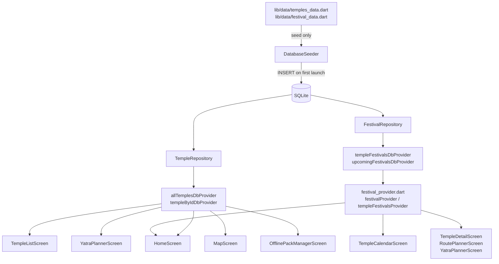

# Design Document: SQLite UI Migration

## Overview

This migration re-wires seven screens and one provider file to read from SQLite via existing Riverpod `FutureProvider`s instead of importing hardcoded Dart lists from `lib/data/`. No UI is redesigned; only data sources change. The hardcoded lists in `lib/data/` become seed-only sources used exclusively by `DatabaseSeeder`.

---

## Architecture

### Data Flow (after migration)



The key invariant: screens never import from `lib/data/` directly. All reads go through `db_providers.dart`.

---

## Components and Interfaces

### festival_provider.dart — Sync Wrapper Pattern

The two legacy providers must keep their synchronous `Provider<List<FestivalEvent>>` signatures because five call sites depend on them and must not be modified.

**Strategy**: unwrap the async DB providers using `.when(data:, loading:, error:)` inside a synchronous `Provider`.

```dart
// Before
final festivalProvider = Provider<List<FestivalEvent>>(
  (ref) => allFestivalEvents,
);

// After
final festivalProvider = Provider<List<FestivalEvent>>((ref) {
  return ref.watch(upcomingFestivalsDbProvider(9999)).when(
    data: (d) => d,
    loading: () => [],
    error: (_, __) => [],
  );
});

final templeFestivalsProvider = Provider.family<List<FestivalEvent>, String>(
  (ref, templeId) => ref.watch(templeFestivalsDbProvider(templeId)).when(
    data: (d) => d,
    loading: () => [],
    error: (_, __) => [],
  ),
);
```

`festivalProvider` uses a large limit (e.g. 9999) to fetch all festivals for the crowd engine. `templeFestivalsProvider` delegates directly to `templeFestivalsDbProvider`. All existing call sites continue to receive `List<FestivalEvent>` synchronously — they see `[]` during loading and the real data once resolved.

### HomeScreen

- Becomes a `ConsumerStatefulWidget` (already is one).
- Watches `allTemplesDbProvider` and `upcomingFestivalsDbProvider(3)`.
- `_buildFeaturedSection`: uses `.when(data:, loading:, error:)` — shows `CircularProgressIndicator` while loading, `ListView.builder` on data.
- `_buildFestivalsSection`: watches `upcomingFestivalsDbProvider(3)` directly instead of `festivalProvider`; removes the manual `.take(3)` / sort (repository handles it).
- `_buildQuickActionsSection` "Festivals" button and "View All" button: use `allTemplesDbProvider.value?.first` with a null guard instead of `allTemples.first`.
- Removes `import '../data/temples_data.dart'`.

### TempleListScreen

- Converts `StatefulWidget` → `ConsumerStatefulWidget`, `State` → `ConsumerState`.
- Watches `allTemplesDbProvider` in `build`.
- `_getFilteredTemples(List<Temple> source)` takes the resolved list as a parameter instead of reading `allTemples` directly.
- `build` returns loading/error widgets before reaching the list builder.
- Removes `import '../data/temples_data.dart'`.

### YatraPlannerScreen

- Already a `ConsumerStatefulWidget`.
- Removes `final List<Temple> _availableTemples = allTemples` instance field.
- In `build`, watches `allTemplesDbProvider` and uses `.when(data:, loading:, error:)`.
- On loading: shows `CircularProgressIndicator` in place of the chip `Wrap`.
- On data: passes resolved list as local `availableTemples` variable to the chip builder.
- `_selectAllTemples`, `_clearSelection`, `_selectTopRated` receive the list as a parameter or read from state.
- Removes `import '../data/temples_data.dart'`.

### MapScreen — Async initState Strategy

`_loadTempleMarkers()` is called from `initState`, which runs before the first `build` and cannot call `ref.watch`. The fix:

1. Convert `StatefulWidget` → `ConsumerStatefulWidget`.
2. Remove `_loadTempleMarkers()` call from `initState`.
3. In `build`, watch `allTemplesDbProvider`.
4. When the provider transitions from loading → data for the first time, call `_loadTempleMarkersFromList(temples)` inside the `.when(data:)` branch using a `didUpdateWidget`-style guard (`_markersLoaded` bool flag).

```dart
// In build:
final templesAsync = ref.watch(allTemplesDbProvider);
templesAsync.whenData((temples) {
  if (!_markersLoaded) {
    _markersLoaded = true;
    WidgetsBinding.instance.addPostFrameCallback((_) {
      _loadTempleMarkersFromList(temples);
    });
  }
});
```

The bottom sheet and `_fitAllTemples` use the resolved list stored in a `List<Temple>? _temples` field, set when data first arrives. While loading, the bottom sheet shows a `CircularProgressIndicator`.

- Removes `import '../data/temples_data.dart'`.

### OfflinePackManagerScreen / _AudioPackCard

- `_AudioPackCard` is already a `ConsumerWidget`.
- In `_AudioPackCard.build`, watch `allTemplesDbProvider`.
- Replace `allTemples.firstWhere(...)` with a lookup on the resolved list.
- If provider is still loading or temple not found: navigate with `templeId` only (no `temple` argument), or use a fallback `Temple` constructed from the id string.
- Removes `import '../data/temples_data.dart'`.

```dart
// In _AudioPackCard.build:
final templesAsync = ref.watch(allTemplesDbProvider);
final temples = templesAsync.valueOrNull ?? [];

// In Play button handler:
final temple = temples.isEmpty
    ? null
    : temples.where((t) => t.id == pack.templeId).firstOrNull;
Navigator.push(context, MaterialPageRoute(
  builder: (_) => StorytellingScreen(
    templeId: pack.templeId,
    temple: temple, // null-safe; StorytellingScreen handles null temple
  ),
));
```

### TempleCalendarScreen

- Minimal change: remove `import '../data/festival_data.dart'`.
- Replace `computeCrowdLevel(temple.id, event.date, allFestivalEvents)` with `computeCrowdLevel(temple.id, event.date, allEvents)` — `allEvents` is already watched via `templeFestivalsProvider(temple.id)`.

---

## Data Models

No model changes. All existing models (`Temple`, `FestivalEvent`, `AudioPack`) are unchanged. The migration is purely at the provider/screen layer.

---

## Correctness Properties

*A property is a characteristic or behavior that should hold true across all valid executions of a system — essentially, a formal statement about what the system should do. Properties serve as the bridge between human-readable specifications and machine-verifiable correctness guarantees.*

### Property 1: Temple Seeding Round-Trip

*For any* list of temples seeded into SQLite by `DatabaseSeeder`, calling `TempleRepository.getAll()` must return a list of equal length containing the same temple IDs.

**Validates: Requirements 6.1, 6.4**

### Property 2: Festival Filter Correctness

*For any* `templeId`, calling `FestivalRepository.getForTemple(templeId)` must return only festivals whose `templeId` field equals the queried id — no festivals from other temples may appear in the result.

**Validates: Requirements 6.2, 6.5**

### Property 3: Upcoming Festivals Metamorphic Property

*For any* limit `N ≥ 0`, calling `FestivalRepository.getUpcoming(N)` must return a list of at most `N` items where every item's date is on or after today, and the list is sorted in ascending date order.

**Validates: Requirements 6.3, 6.6**

---

## Error Handling

| Scenario | Behavior |
|---|---|
| `allTemplesDbProvider` loading | Show `CircularProgressIndicator` in place of temple list/cards |
| `allTemplesDbProvider` error | Show inline error message with the error string |
| `templeFestivalsDbProvider` loading | `templeFestivalsProvider` returns `[]`; screens show empty state |
| `upcomingFestivalsDbProvider` empty | HomeScreen shows "No upcoming festivals found." |
| Temple not found in `OfflinePackManagerScreen` | Navigate with `templeId` only; no crash |
| `MapScreen` data arrives after map created | `addPostFrameCallback` ensures markers are added on next frame |

---

## Testing Strategy

Tests go in `test/database/migration_test.dart`. The existing `db_test.dart` (16 tests) and `identity_test.dart` (20+ tests) are not modified.

### Unit Tests (specific examples and edge cases)

- Seed an empty database, call `getAll()` → returns `[]`.
- Seed one temple, call `getById(id)` → returns that temple.
- Call `getForTemple("nonexistent_id")` → returns `[]`.
- Call `getUpcoming(0)` → returns `[]`.
- Call `getUpcoming(3)` with only 1 future festival seeded → returns list of length 1.

### Property-Based Tests

Uses the [`dart_test`](https://pub.dev/packages/test) package with manual generators (or `fast_check` / `propcheck` if available in the project). Each property test runs a minimum of **100 iterations**.

**Property 1 — Temple Seeding Round-Trip**
```
// Feature: sqlite-ui-migration, Property 1: Temple seeding round-trip
// For any list of N randomly generated temples, seed them, read back, length == N and IDs match
```

**Property 2 — Festival Filter Correctness**
```
// Feature: sqlite-ui-migration, Property 2: Festival filter correctness
// For any templeId and any set of seeded festivals, getForTemple(templeId)
// returns only festivals where festival.templeId == templeId
```

**Property 3 — Upcoming Festivals Metamorphic**
```
// Feature: sqlite-ui-migration, Property 3: Upcoming festivals metamorphic
// For any limit N and any set of seeded festivals (mix of past/future),
// getUpcoming(N).length <= N, all dates >= today, list is sorted ascending
```

Each property test must:
- Use an in-memory SQLite database (`:memory:`) to avoid test pollution.
- Generate random inputs (random temple IDs, names, dates) for each iteration.
- Reference the property number in a comment tag at the top of the test.
