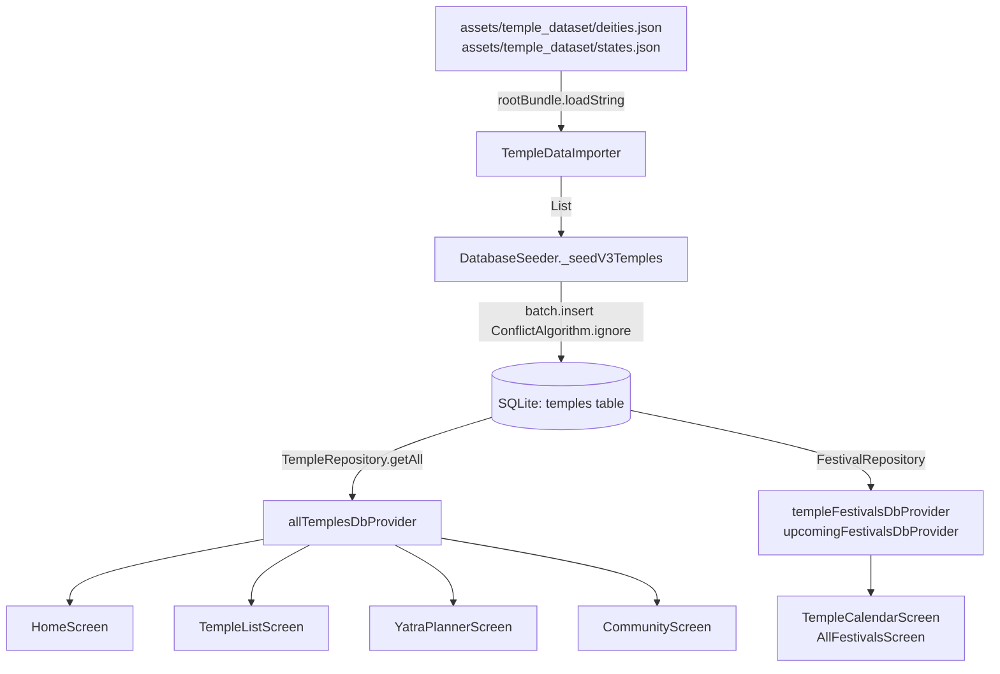

# Design Document: Temple Data Expansion

## Overview

Expand temple coverage from 10 hardcoded entries to the full `rishabhmodi03/hindu-temples` dataset by:
1. Bundling the two source JSON files as Flutter assets
2. A new `TempleDataImporter` class that normalizes them to `Temple` objects
3. A new seed version 3 in `DatabaseSeeder` that inserts the expanded set idempotently
4. Removing the one remaining non-seeder hardcoded data import (`audio_pack_service.dart` uses `allAudioPacks` — audio packs are out of scope for this expansion; the only migration target for temple/festival data is confirming screens already use providers)

SQLite remains the sole runtime source of truth. No backend, no schema changes, no UI redesign.

---

## Architecture



**Data flow at first launch:**
`main()` → `DatabaseSeeder.seedIfNeeded()` → checks `seeded_versions` → runs v1, v2, v3 in order → marks each version → app starts → screens read from SQLite via providers.

---

## Components and Interfaces

### 1. Asset placement

```
assets/
  temple_dataset/
    deities.json    ← copied verbatim from rishabhmodi03/hindu-temples/data/
    states.json     ← copied verbatim from rishabhmodi03/hindu-temples/data/
```

`pubspec.yaml` addition:
```yaml
flutter:
  assets:
    - .env
    - assets/temple_dataset/deities.json
    - assets/temple_dataset/states.json
```

### 2. TempleDataImporter

**File:** `lib/data/temple_data_importer.dart`

```dart
class TempleDataImporter {
  /// Loads both JSON assets and returns deduplicated, normalized Temple list.
  /// Existing temples (matched by canonical id) are merged — existing non-null
  /// fields are never overwritten.
  static Future<List<Temple>> load({
    required List<Temple> existingTemples,
    AssetBundle? bundle,
  }) async { ... }

  /// Pure function: derives canonical snake_case id from a temple name.
  /// Rules: lowercase → replace [^a-z0-9]+ with '_' → collapse '__+' → strip leading/trailing '_'
  static String deriveId(String name) { ... }

  /// Merges dataset entry into existing temple, preserving non-null fields.
  static Temple merge(Temple existing, Temple incoming) { ... }
}
```

**Internal steps inside `load()`:**
1. `rootBundle.loadString('assets/temple_dataset/deities.json')` → parse JSON list
2. `rootBundle.loadString('assets/temple_dataset/states.json')` → parse JSON list
3. For each entry, call `_normalize()` to produce a `Temple` with fallbacks applied
4. Build a `Map<String, Temple>` keyed by canonical id; on collision keep the entry with more non-null fields
5. For each existing temple: if its id appears in the map, call `merge(existing, incoming)` (existing wins on non-null fields); otherwise keep existing as-is
6. Append any new temples from the dataset that don't collide with existing ids
7. Return combined list

**Field mapping from `deities.json`** (representative fields — exact keys depend on dataset):

| Dataset field | Temple field | Fallback |
|---|---|---|
| `name` / `temple_name` | `name` | required — skip entry if absent |
| `latitude` / `lat` | `latitude` | `0.0` |
| `longitude` / `lng` | `longitude` | `0.0` |
| `address` / `location` | `address` | `''` |
| `deity` / `main_deity` | `deityInfo` | `''` |
| `state` | `region` | `''` |
| `description` / `about` | `distinctiveFeatures` | `''` |
| `timings` / `darshan_timings` | `darshanTimings` | `'6:00 AM - 8:00 PM'` |
| `prasadam` | `prasadamInfo` | `''` |
| `festivals` (string/list) | `festivals` | `''` |

`placeId` is set to `''` for imported entries (no Google Places data).

**`deriveId()` algorithm:**
```dart
static String deriveId(String name) {
  return name
      .toLowerCase()
      .replaceAll(RegExp(r'[^a-z0-9]+'), '_')
      .replaceAll(RegExp(r'_+'), '_')
      .replaceAll(RegExp(r'^_|_$'), '');
}
```

### 3. DatabaseSeeder — seed version 3

**File:** `lib/database/database_seeder.dart` (existing file, additive change only)

```dart
static const int _seedVersion3 = 3;

static Future<void> seedIfNeeded() async {
  // ... existing v1 and v2 blocks unchanged ...

  if (!await appDb.isSeeded(_seedVersion3)) {
    debugPrint('[DatabaseSeeder] Seeding v$_seedVersion3…');
    final db = await appDb.db;
    final importedTemples = await TempleDataImporter.load(
      existingTemples: allTemples,  // existing hardcoded list for merge
    );
    await db.transaction((txn) async {
      await _seedV3Temples(txn, importedTemples);
      await _seedV3Festivals(txn, importedTemples);
    });
    await appDb.markSeeded(_seedVersion3);
    debugPrint('[DatabaseSeeder] Seed v$_seedVersion3 complete.');
  }
}
```

`_seedV3Temples` iterates `importedTemples`, calls `batch.insert('temples', ..., conflictAlgorithm: ConflictAlgorithm.ignore)` — same column map as `_seedTemples`.

`_seedV3Festivals` inserts minimal festival rows for newly imported temples that have a non-empty `festivals` text field. Each comma-separated festival name becomes one row with a placeholder date (`2026-01-01`) and `crowd_hint: 'high'`. Existing festival rows are untouched (`ConflictAlgorithm.ignore` on the `festivals` table).

**Tables NOT touched by v3:** `community_stories`, `user_profiles`, `itinerary_drafts`, `audio_packs`, `audio_tracks`.

### 4. UI provider wiring audit

Grep result: no screen file imports `temples_data.dart`, `festival_data.dart`, or `audio_pack_data.dart`. The only non-seeder import of hardcoded data is `audio_pack_service.dart` importing `audio_pack_data.dart` — this is for audio pack management, not temple/festival display, and is out of scope.

All temple/festival screens already use the correct providers:
- `HomeScreen` → `allTemplesDbProvider` ✓
- `TempleListScreen` → `allTemplesDbProvider` ✓  
- `YatraPlannerScreen` → `allTemplesDbProvider` ✓
- `CommunityScreen` → `allTemplesDbProvider` ✓
- `AllFestivalsScreen` → `upcomingFestivalsDbProvider` ✓
- `TempleCalendarScreen` → `templeFestivalsDbProvider` ✓

No screen-level migration is required. The expanded dataset will be visible automatically once v3 seeding runs.

---

## Data Models

No new models. `Temple` already has all required fields. The importer produces standard `Temple` instances.

**Canonical id invariant:** `id` matches `^[a-z0-9][a-z0-9_]*[a-z0-9]$` (or single char `[a-z0-9]`). No consecutive underscores, no leading/trailing underscores.

**Merge rule:** `merge(existing, incoming)` returns a `Temple` where each field is `existing.field ?? incoming.field`. Required fields (`id`, `name`, `latitude`, `longitude`, `darshanTimings`) always come from `existing` since they are non-nullable and already populated.

---

## Correctness Properties

*A property is a characteristic or behavior that should hold true across all valid executions of a system — essentially, a formal statement about what the system should do. Properties serve as the bridge between human-readable specifications and machine-verifiable correctness guarantees.*

Use [`test`](https://pub.dev/packages/test) with [`fast_check`](https://pub.dev/packages/fast_check) (or hand-rolled generators with `dart:math` Random) for property tests. Minimum 100 iterations per property.

### Property 1: Canonical id is valid snake_case

*For any* non-empty temple name string (including names with spaces, diacritics, punctuation, mixed case), `TempleDataImporter.deriveId(name)` SHALL produce a string that:
- contains only characters matching `[a-z0-9_]`
- has no consecutive underscores (`__`)
- does not start or end with an underscore
- is non-empty

**Validates: Requirements 2.4, 6.1**

### Property 2: All required fields are populated after import

*For any* `Temple` object produced by `TempleDataImporter.load()`, the fields `id`, `name`, `latitude`, `longitude`, and `darshanTimings` SHALL be non-null and non-empty (where non-empty means `!= ''` for strings and `!= 0.0` is not required — coordinates of `0.0` are a valid fallback per Req 2.3).

**Validates: Requirements 2.2, 2.3, 6.2**

### Property 3: Seeder idempotency

*For any* fresh in-memory SQLite database, running `DatabaseSeeder.seedIfNeeded()` twice SHALL produce the same row count in the `temples` table as running it once.

**Validates: Requirements 3.3, 6.3**

### Property 4: Temple repository round-trip

*For any* `Temple` object, inserting it via `TempleRepository.upsert()` and then retrieving it via `TempleRepository.getById(id)` SHALL return a `Temple` where all non-null fields equal the original.

**Validates: Requirements 6.4**

### Property 5: Itinerary arrival times are monotonically increasing

*For any* day plan with N ≥ 2 temples generated by `ItineraryGenerator`, the sequence of arrival and departure times SHALL be strictly monotonically increasing: `arrival[i] < departure[i] < arrival[i+1]` for all valid i.

**Validates: Requirements 5.4, 6.5**

### Property 6: Merge preserves existing non-null fields

*For any* existing `Temple` with a non-null field F, calling `TempleDataImporter.merge(existing, incoming)` SHALL return a temple where field F equals `existing.F`, regardless of the value of `incoming.F`.

**Validates: Requirements 2.8**

---

## Error Handling

| Scenario | Handling |
|---|---|
| Asset file missing at runtime | `FlutterError` from `rootBundle` — caught in `seedIfNeeded`, logged, v3 skipped (app still starts with v1+v2 data) |
| Malformed JSON in asset | `FormatException` caught in importer, returns empty list, v3 seed inserts nothing |
| Temple entry missing `name` | Entry skipped entirely (cannot derive a meaningful id) |
| Duplicate canonical id | Keep entry with more non-null fields; log the collision at debug level |
| Partial transaction failure | SQLite transaction rolls back atomically; `markSeeded(3)` is never called; retry on next launch |
| `latitude`/`longitude` absent | Default to `0.0` per Req 2.3; these temples will not appear on map but are still searchable |

---

## Testing Strategy

Six focused tests, no more. Use `sqflite_common_ffi` (already in `dev_dependencies`) for in-memory DB tests.

| # | Type | File | What it verifies |
|---|---|---|---|
| T1 | Property | `test/data/temple_data_importer_test.dart` | `deriveId` produces valid snake_case for any input (Property 1) |
| T2 | Property | `test/data/temple_data_importer_test.dart` | All required fields non-null/non-empty on any produced Temple (Property 2) |
| T3 | Property | `test/database/database_seeder_test.dart` | `seedIfNeeded()` twice = same row count as once (Property 3) |
| T4 | Property | `test/database/temple_repository_test.dart` | upsert → getById round-trip preserves all fields (Property 4) |
| T5 | Property | `test/services/itinerary_generator_test.dart` | Arrival/departure times strictly increasing for any N-temple plan (Property 5) |
| T6 | Example | `test/data/temple_data_importer_test.dart` | `load()` reads bundled assets without network calls; all 10 existing ids present in output |

**T1 generator:** random strings from printable ASCII + Unicode letters, length 1–100.  
**T2 generator:** random subset of dataset entries (load real asset file, shuffle, pick N).  
**T3:** fresh `sqflite_common_ffi` in-memory DB; call `seedIfNeeded()`, record count, call again, compare.  
**T4 generator:** random `Temple` with all fields populated via `faker`-style helpers.  
**T5 generator:** random list of 2–8 temple ids from the seeded set, random start time.  
**T6:** uses `rootBundle` with `TestWidgetsFlutterBinding.ensureInitialized()`; no `http` calls.

Each property test runs ≥ 100 iterations. Tag format in test comments:
```
// Feature: temple-data-expansion, Property N: <property text>
```
