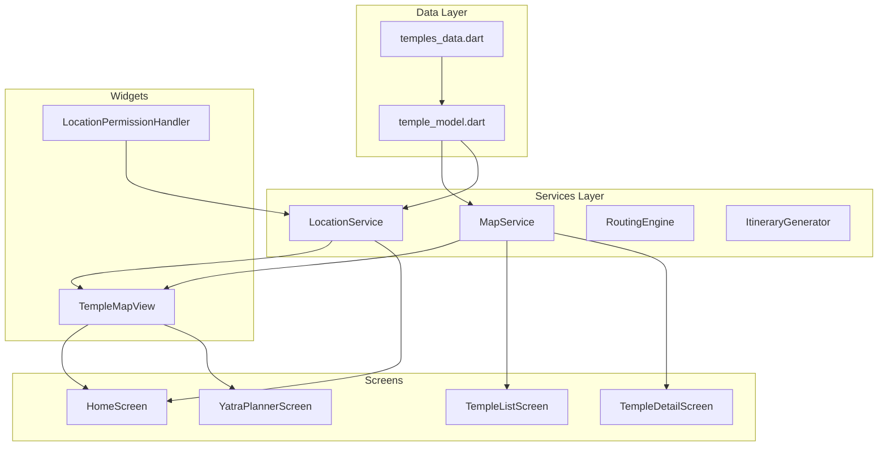

# Temple Yatra Flutter Application - Technical Summary

## Project Overview

Temple Yatra is a Flutter-based mobile application designed for temple discovery and yatra (pilgrimage) planning in the Hyderabad and Telangana region of India. The application serves as a comprehensive guide for devotees planning spiritual journeys, offering features such as temple discovery, route planning, budget estimation, itinerary generation, and audio guides for temple visits.

The application has undergone multiple development phases with various bug fixes and feature implementations. The current development focus centers on resolving critical issues related to maps integration and live location functionality, which are essential for the core user experience of temple discovery and navigation.

The project is configured as an Android-first application with iOS support, following Material Design guidelines and implementing a clean architecture pattern with separation of concerns across data, models, services, screens, and widgets layers.

---

## Work Completed So Far

### Core Infrastructure

The application foundation has been properly established with all necessary dependencies configured in `pubspec.yaml`. The core packages include `google_maps_flutter` for map visualization, `geolocator` for location services, `flutter_riverpod` for state management, `http` for API calls, `flutter_tts` for text-to-speech functionality, and `url_launcher` for external navigation and calling capabilities.

The `main.dart` file establishes the application structure with a `TempleYatraApp` widget wrapped in a `ProviderScope` for Riverpod state management. The app uses a custom `AppTheme` that defines the visual identity with consistent color palettes including saffron, maroon, and temple gold colors that reflect the spiritual theme of the application. Navigation is configured through `MaterialApp` with `HomeScreen` set as the default route.

### Screen Implementations

**HomeScreen** has been enhanced with a functional search bar that queries temple data from the centralized data repository. The UI includes a hero animation header displaying the temple imagery or icon, navigation cards with custom styling using `AppTheme` constants, and a responsive layout that adapts to different screen sizes. The search functionality now properly navigates users to the `TempleListScreen` when they submit a search query, and the screen has been converted to a `StatefulWidget` to manage the `TextEditingController` properly.

**TempleDetailScreen** now properly receives navigation arguments and displays comprehensive temple information. The screen includes a `SliverAppBar` with an expanded height for displaying temple imagery, rating and distance information, address and timings details, quick action buttons for directions and calling, and sections for about information, festivals, prasadam details, and darshan timings. The directions button opens Google Maps with the temple coordinates, and the call button uses `url_launcher` to initiate phone calls when phone numbers are available.

**TempleListScreen** displays temple listings with filtering and search capabilities. The screen implements search functionality that filters temples by name and address, filter chips for selecting different view modes (All, Featured, Nearby, Favorites), sorting by distance for nearby temples and by rating for featured temples, and proper distance calculations from Hyderabad center coordinates.

**YatraPlannerScreen** provides the core yatra planning functionality with budget estimation based on vehicle type and accommodation preferences, date selection for trip planning, temple selection with maximum temples per day constraints, and navigation to route planning and simulation screens.

### Theme and Design System

The `AppTheme` class defines the application's visual identity with consistent styling across all screens. The color palette uses primary saffron (#FF9933), secondary maroon (#800000), and temple gold (#FFD700) colors that create an authentic spiritual aesthetic. Text themes are configured for headlines, titles, and body text with proper typography scaling that ensures readability across different device sizes.

Custom button styles and card decorations maintain visual consistency throughout the application. The design system implements shadow effects, gradient backgrounds, and border radius values that create a modern yet traditional feel appropriate for a temple guide application.

### Data Architecture

The `temples_data.dart` file serves as the central data repository containing information for 10 temples in the Hyderabad and Telangana region. Each temple entry includes geographic coordinates (latitude and longitude), descriptive text for distinctive features and festivals, prasadam information, darshan timings, ratings from user reviews, and address details.

The data structure supports filtering operations through the `filterTemplesByDistance` function that calculates distances using the Haversine formula and sorts temples by proximity to a given center point. The `Temple` model class in `temple_model.dart` defines the data structure with required and optional fields that support both online and offline operation modes.

### Service Layer

The application implements a comprehensive service layer that handles business logic separation from UI code. The `RoutingEngine` handles route optimization algorithms including nearest neighbor and 2-opt improvement for TSP (Traveling Salesman Problem) solutions. The `ItineraryGenerator` creates day-by-day plans based on constraints such as maximum temples per day, budget limits, and travel preferences.

The `BudgetService` calculates estimated costs for yatras including fuel expenses based on distance and vehicle type, toll costs for highway travel, accommodation charges based on selected comfort level, and food expenses for the trip duration. The `SimulationController` manages yatra simulation state for previewing planned trips before actual execution.

### Build Verification

The Flutter analyze command passes without critical errors, indicating that code syntax and dependency resolution are stable. The project builds successfully for Android and iOS platforms with proper configuration in place. Recent fixes have resolved issues with duplicate function definitions, syntax errors in string literals containing apostrophes, and missing import statements for utility functions.

---

## Issues Requiring Immediate Attention

### Maps Functionality Critical Issues

The Google Maps integration is experiencing critical failures that prevent proper user interaction with the map features essential for temple discovery and navigation.

**Map Tiles Loading Failure**: The Google Maps tiles fail to load properly, displaying blank or corrupted render areas that prevent temple location visualization. This issue could stem from improper API key configuration, network connectivity problems, or incorrect widget initialization timing. Users are unable to see temple locations on the map, which significantly degrades the core value proposition of the application.

**Marker Rendering Problems**: Temple markers do not render correctly on the map. Some markers are missing entirely while others display incorrect positioning on the map canvas. The connection between the temple data in `temples_data.dart` and the marker creation functions appears to be broken, preventing the visualization of temple locations that users need for planning their yatra routes.

**Camera Control Unresponsiveness**: Zoom, pan, and rotation controls on the map are unresponsive in many scenarios. This prevents users from exploring temple locations in different areas or adjusting their view to see multiple temples simultaneously. The issue requires user interaction testing across different device configurations to identify the root cause.

**Custom InfoWindow Issues**: InfoWindows for temple markers do not display temple names or details when markers are tapped. This breaks expected user experience patterns where users should be able to tap a temple marker to see basic information and options to navigate to that temple or add it to their yatra.

**Map Style Configuration**: Custom map style configurations are not being applied correctly, preventing the integration of custom theming that would match the application's spiritual theme. The style JSON configuration may not be loading properly or may contain syntax errors.

### Live Location Services Problems

Location services are critical for the nearby temples feature and real-time navigation during yatras. Current implementation has several issues that prevent reliable location functionality.

**Initialization Failure**: Location services initialization fails on app startup, with the `geolocator` package not properly configuring location permissions. The app does not request permissions at the appropriate time, and users are not prompted to enable location services when the app first loads.

**Intermittent Real-time Updates**: Location updates are intermittent with significant delays between position changes and UI updates on the map. The location stream may not be properly configured with appropriate update intervals, or the callback functions may not be triggering UI rebuilds correctly.

**Accuracy Settings**: Location accuracy settings are not optimized for the temple discovery use case. Coarse accuracy provides insufficient precision for determining which temple a user is closest to, especially in urban areas with multiple temples in close proximity.

**Background Location**: Background location tracking functionality is not implemented, preventing continuous location awareness when the app is minimized. Users cannot receive proximity notifications or have their location tracked during active yatras.

**Service Status Monitoring**: Location service status monitoring is absent, preventing proper user feedback when location services are disabled on the device. The app should detect when location services are off and guide users to enable them.

### Integration Breakages

**Data Passing Issues**: Temple location data from `temples_data.dart` is not properly passed to map marker creation functions. The mapping between the data layer and visual elements fails, causing markers to not appear or appear at incorrect coordinates.

**Permission Handling**: Location permission handling does not follow current platform guidelines for Android and iOS. The permission request logic needs updates to comply with privacy requirements and provide proper explanation strings.

**Controller Initialization**: Map controller initialization timing issues cause race conditions where the map is accessed before the controller is ready. This leads to null reference errors and failed map operations.

**State Management**: Location update callbacks are not properly bound to `setState` calls, preventing UI refresh when location changes occur. The Riverpod state management may not be integrated correctly with the location stream.

---

## Modular Implementation Plan

### Phase 1: Maps Rendering Foundation

The first phase focuses on establishing a solid foundation for map rendering by addressing configuration and initialization issues.

**Package Configuration Verification**: Begin by verifying the `google_maps_flutter` package configuration in `pubspec.yaml` to ensure version compatibility with the current Flutter SDK. Check that the `google_maps_flutter_platform_interface` version matches the main package version. Review Android Gradle configuration to confirm that the Google Maps Android SDK dependencies are properly declared in `android/build.gradle.kts`.

**MapService Wrapper Creation**: Create a `MapService` wrapper class in `lib/services/map_service.dart` that encapsulates all map-related operations. This service should manage the `GoogleMapsController` reference, handle marker creation and removal, manage camera positioning and animations, and provide a clean API for other parts of the application to interact with the map without direct widget access.

**Asynchronous Initialization**: Implement proper asynchronous initialization of the Google Maps widget using the `FutureBuilder` pattern. This ensures that the map controller is fully ready before users can interact with it, preventing race conditions and null reference errors. Create a initialization future that completes when the map controller is attached and ready.

**Error Handling**: Add explicit error handling for map rendering failures with graceful degradation showing placeholders when tiles fail to load. Implement a fallback UI that displays temple information in a list format when the map is unavailable, ensuring users can still access temple information.

**Map Styling**: Implement basic map styling using a JSON configuration file. Create `assets/map_style.json` with custom style definitions that apply the application's color theme to map elements. Verify that style application works correctly before adding more complex styling.

### Phase 2: Temple Location Integration

The second phase focuses on connecting the temple data to the map display with proper marker rendering and user interaction.

**Location Data Methods**: Extend the `Temple` model with location-related methods that return `LatLng` objects from stored latitude and longitude fields. Add helper methods for calculating distances to other temples and determining if a temple falls within a specific geographic bounding box.

**TempleMarkerService**: Create a `TempleMarkerService` that converts `Temple` objects into Google Maps `Marker` objects. This service should handle icon configuration using custom marker icons if available, info window content generation with temple name and basic information, marker ID assignment using temple IDs for later reference, and callback configuration for marker tap events.

**Marker Clustering**: Implement marker clustering for areas with multiple temples to improve performance and visual clarity when users are zoomed out. Use the `MarkerLayer` and clustering packages to group nearby temples into cluster markers that show the count of temples in that area.

**Custom InfoWindow**: Develop a custom `InfoWindow` widget implementation that displays temple name, distance from current location, rating, and basic information when markers are tapped. Create a widget that can be embedded in the map's info window system with proper sizing and layout.

**Navigation Integration**: Connect `TempleListScreen` and `TempleDetailScreen` navigation to pass temple objects to the map view for focused display. Implement functionality to animate the camera to a specific temple's location when users select it from a list.

### Phase 3: Live Location Infrastructure

The third phase implements the location services that enable nearby temple discovery and real-time navigation.

**LocationService Class**: Implement a `LocationService` class wrapping the `geolocator` package with proper permission checking and requesting logic. This service should check location permission status before attempting to get location, request appropriate permissions (foreground for basic use, background for continuous tracking), handle permission denial scenarios with clear user feedback, and provide a unified interface for location operations.

**Permission Dialog UI**: Create location permission dialog UI that explains why location access is needed and handles user denial gracefully. The dialog should clearly communicate the benefits of location access for temple discovery, provide a way to retry if users initially deny, and respect user choices while offering alternative ways to browse temples.

**Continuous Location Stream**: Implement continuous location stream using `geolocator.getPositionStream` with appropriate settings. Configure accuracy to high for precise temple proximity detection, set distance filter to balance accuracy and battery usage, and handle stream errors and completion properly.

**Location Update Callbacks**: Create a callback system that notifies subscribed widgets when device position changes. Integrate with Riverpod state management to update the UI automatically when location updates arrive.

**User Location Marker**: Implement user location marker on the map that updates in real-time as device position changes. Add animated transitions so the marker moves smoothly between positions rather than jumping.

### Phase 4: Advanced Location Features

The fourth phase adds advanced functionality that enhances the yatra planning experience through location-aware features.

**Background Location Service**: Implement geofencing around temple locations using Android foreground service for reliable background location tracking. This ensures location tracking continues even when the app is minimized during active yatras.

**Proximity Detection**: Add proximity detection that triggers UI notifications when users approach predefined temple radius thresholds. Implement configurable notification timing to alert users when they are within walking distance of a planned temple stop.

**Nearby Temple Suggestions**: Implement location-based temple suggestions showing nearby temples sorted by distance from current position. Create a "Temples Near Me" feature that leverages the `filterTemplesByDistance` function with the user's current location.

**Route Recording**: Add location history tracking for yatra route recording with export functionality. Allow users to save their completed yatra routes and share them with others.

**Offline Location Caching**: Implement offline location caching for areas with poor GPS signal, maintaining location awareness during connectivity loss. Cache the last known position and temple locations for offline access.

---

## Required Code Changes Summary

### New Files to Create

| File | Purpose |
|------|---------|
| `lib/services/map_service.dart` | MapService wrapper class managing controller and rendering operations |
| `lib/services/location_service.dart` | LocationService class handling all geolocation operations |
| `lib/models/temple_location.dart` | Extension of TempleData with location-specific methods |
| `lib/widgets/temple_map_view.dart` | Reusable map widget with marker support |
| `lib/widgets/location_permission_handler.dart` | Permission request dialog component |
| `assets/map_style.json` | Custom map styling configuration |

### Files to Modify

| File | Modification Purpose |
|------|---------------------|
| `lib/main.dart` | Add service initialization and proper error boundaries |
| `lib/screens/home_screen.dart` | Include map integration and location status indicators |
| `lib/data/temples_data.dart` | Add location helper methods and geocoding support |
| `lib/screens/yatra_planner_screen.dart` | Connect with map for route visualization |
| `lib/screens/route_planner_screen.dart` | Integrate live location for user position marker |
| `pubspec.yaml` | Add missing dependencies and verify version compatibility |

### Configuration Updates

**Android Manifest**: Update `android/app/src/main/AndroidManifest.xml` with location permission declarations for both `ACCESS_FINE_LOCATION` and `ACCESS_COARSE_LOCATION`. Add Google Maps API key in the `<meta-data>` element for `com.google.android.geo.API_KEY`. Include foreground service permission if implementing background location tracking.

**iOS Info.plist**: Update `ios/Runner/Info.plist` with `NSLocationWhenInUseUsageDescription` and `NSLocationAlwaysAndWhenInUseUsageDescription` strings explaining why location access is needed. Add API key configuration in `AppDelegate.swift` for Google Maps SDK initialization.

**Google Cloud Console**: Configure Google Cloud Console for Maps SDK access with proper API restrictions. Enable Maps SDK for Android and iOS, create API keys with platform restrictions, and document the setup for future maintenance.

---

## Success Criteria

The implementation will be considered successful when the following criteria are met:

**Maps Functionality**: Temple locations display correctly as markers on the map with proper geographic positioning. Users can tap markers to see InfoWindows with temple names and basic information. The map responds to all camera controls including zoom, pan, and rotation without lag or unresponsiveness. Custom map styling applies correctly, creating a cohesive visual experience.

**Location Services**: Permission requests follow platform guidelines and handle all user response scenarios (grant, deny, ask every time). Live location updates render the user's position on the map in real-time with smooth animated transitions. Location accuracy is sufficient for determining nearby temples in urban environments.

**Background Operation**: The app maintains location awareness during background state with proper battery optimization. Users receive proximity notifications when approaching planned temple stops. Route recording functions correctly during active yatras.

**Offline Capability**: All temple location data remains accessible when network connectivity is unavailable. The app degrades gracefully for location-based features when offline, clearly communicating limitations to users.

**Code Quality**: All Flutter analyze commands pass without errors. Code follows established patterns and includes appropriate documentation. Services are properly separated and testable.

---

## Next Steps for Agent

Begin implementation by examining the current configuration files to understand the existing maps and location setup.

**Step 1**: Read `pubspec.yaml` to verify current dependency versions and identify any missing packages. Check for version conflicts that might cause issues.

**Step 2**: Examine `lib/main.dart` to see how services are initialized and identify where map and location integration points should be added.

**Step 3**: Review `lib/data/temples_data.dart` to understand how location data is stored and verify that latitude and longitude fields are properly formatted for use with Google Maps.

**Step 4**: Check `android/app/src/main/AndroidManifest.xml` and `ios/Runner/Info.plist` for existing location and map permissions to understand what configuration already exists.

**Step 5**: Create the `MapService` and `LocationService` implementations following the modular plan. Start with `MapService` since maps functionality is foundational to other features.

**Step 6**: Test incrementally after each significant change using `flutter analyze` to verify build success. Run on a physical Android device to test actual map rendering and location functionality.

**Step 7**: Prioritize fixing critical rendering issues preventing map visibility before adding advanced features like clustering or background tracking.

---

## Architecture Diagram

---

## Dependency Flow

The application follows a unidirectional data flow where temple data flows from the data layer through services to screens and widgets. Location services operate independently but integrate with the map service to overlay user position on temple locations. The routing engine uses both temple location data and real-time location to calculate optimal paths between temples during yatra planning.

---

*Document Version: 1.0*  
*Last Updated: 2026-02-04*  
*Author: Kiran*
